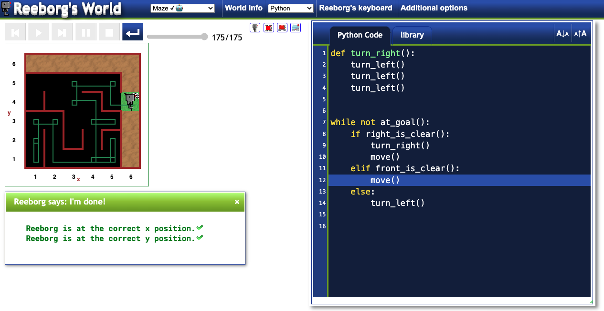

# Day 6: Escaping the Maze (Reeborg's World)

Day 6 of the course focused on learning Python functions and `while` loops in an interactive, browser-based environment called [Reeborg's World](https://reeborg.ca/).

## The Challenge

The main project was to write a program that could guide the robot, Reeborg, out of a randomly generated maze. The same solution needed to work no matter the shape of the maze.

## The Solution

The code uses a simple but effective algorithm, often called the "right-hand rule." The robot follows these steps in a loop until it reaches the goal:
1.  Check if there is a clear path to the right. If so, turn right and move forward one step.
2.  If not, check if there is a clear path ahead. If so, move forward.
3.  If there's no path to the right or ahead, turn left (as there must be a wall in front and to the right).

This logic ensures the robot continuously follows along the right-hand wall, which will eventually lead it to the exit of any simple maze.

## Final Result

Here is a screenshot of the code successfully navigating Reeborg to the goal.

